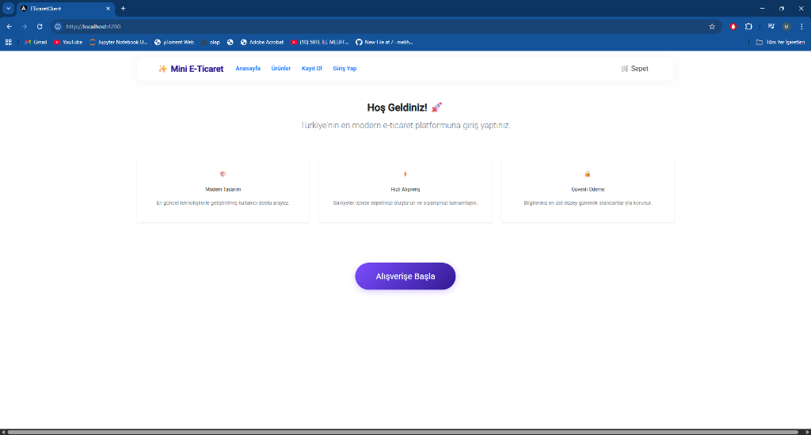
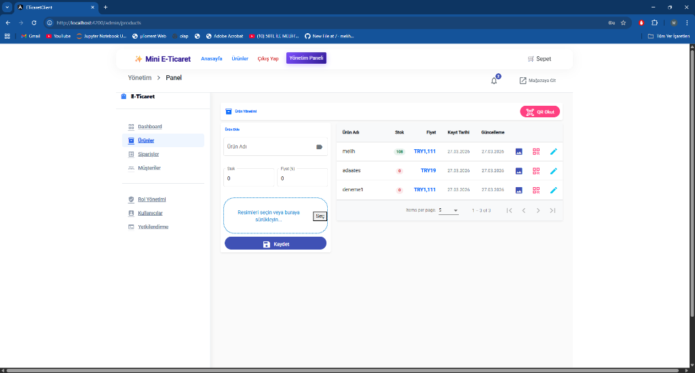
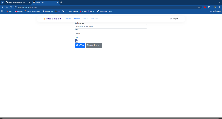
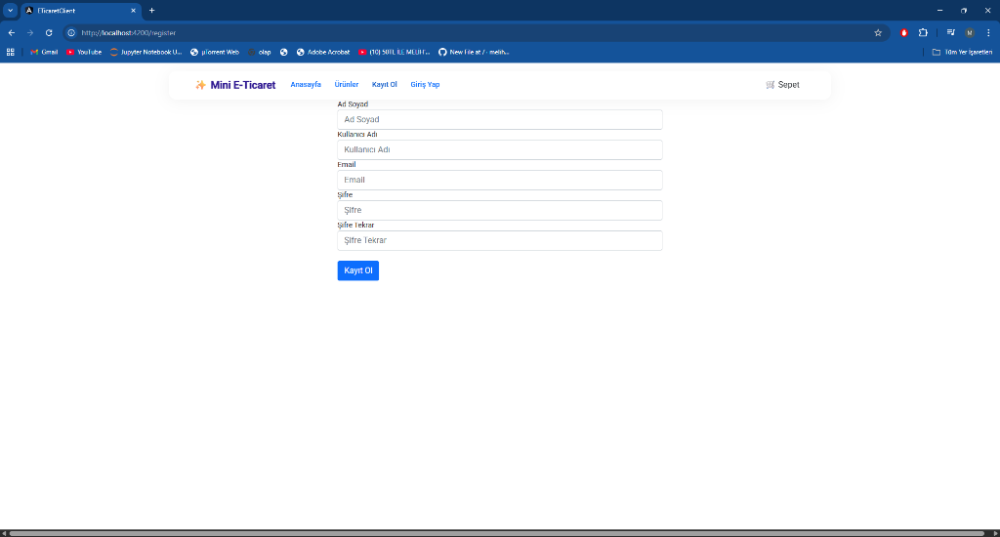
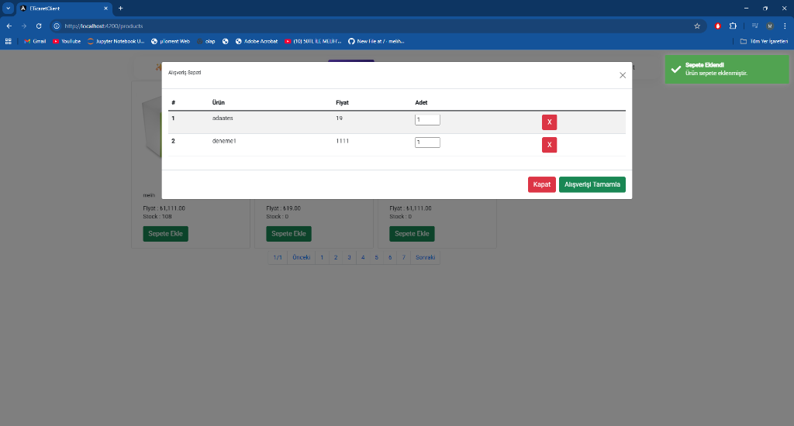
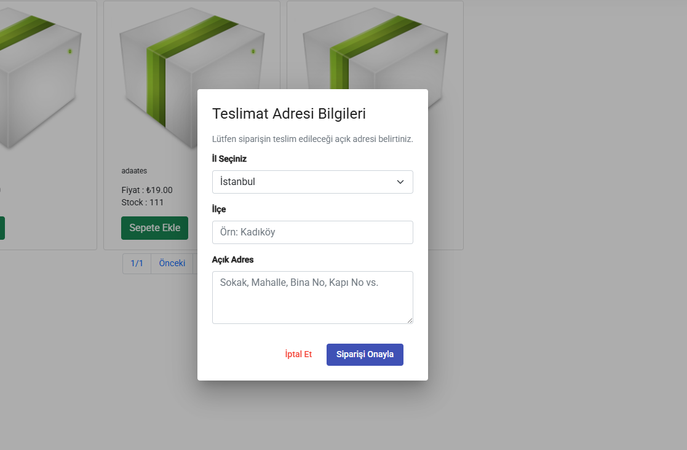
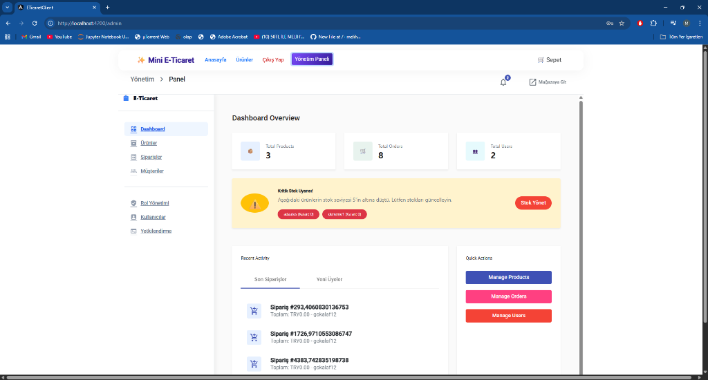
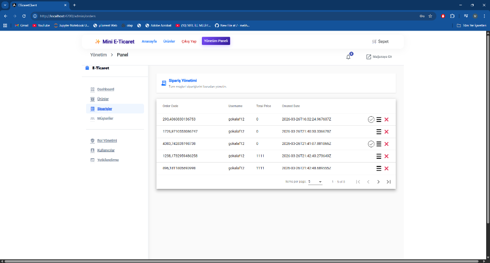
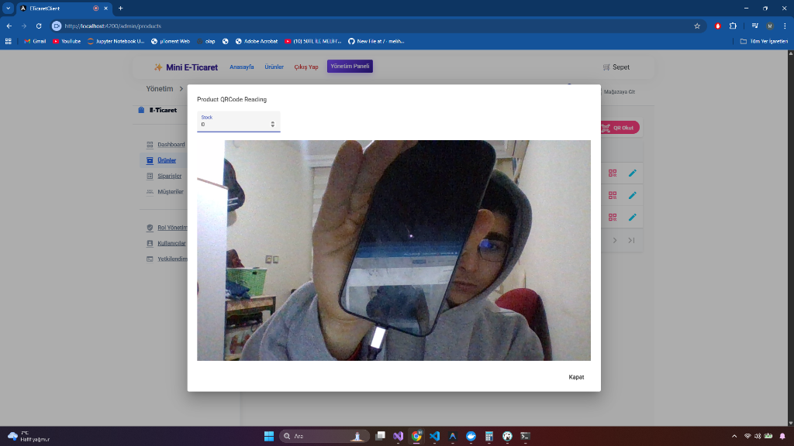

# ecomClient

Modern e-commerce frontend built with Angular for the `ecom.API` backend.
It provides the customer shopping experience and the administrative dashboard in a single UI.

## Highlights

### Customer Experience
- Product browsing and filtering
- Basket management
- Login and registration
- Order tracking
- Responsive layout for desktop and mobile

### Admin Experience
- Product management
- Order management
- User and role management
- QR code workflows
- File upload flows
- Dashboard overview

## Tech Stack

- Angular 14
- TypeScript
- Angular Material
- RxJS
- SCSS
- JWT authentication
- SignalR client
- NgxSpinner, NgxToastr, AlertifyJS

## Backend Repository

The API, database, authentication and business rules are in a separate repository:

- [ecom.API](https://github.com/melihesensio99/ecom.API)

## Getting Started

### Prerequisites
- Node.js 16+
- Angular CLI

### Install and Run

```bash
npm install
ng serve
```

Open `http://localhost:4200` in your browser.

## Project Structure

- `src/app/ui` - customer-facing pages
- `src/app/admin` - admin dashboard and management pages
- `src/app/services` - API clients, auth, SignalR and helpers
- `src/app/contracts` - request and response models
- `src/app/dialogs` - reusable dialogs
- `screenshots` - preview images used in this README

## Screenshots

### Home and Catalog
<p align="center">
  
  
</p>

### Authentication
<p align="center">
  
  
</p>

### Basket and Checkout
<p align="center">
  
  
</p>

### Dashboard and Management
<p align="center">
  
</p>
<p align="center">
  
  
</p>

## Notes

This repository contains the frontend only. It expects the backend API to be available from the `ecom.API` repository.

## Author

Developed by [Melih Esen](https://github.com/melihesensio99)